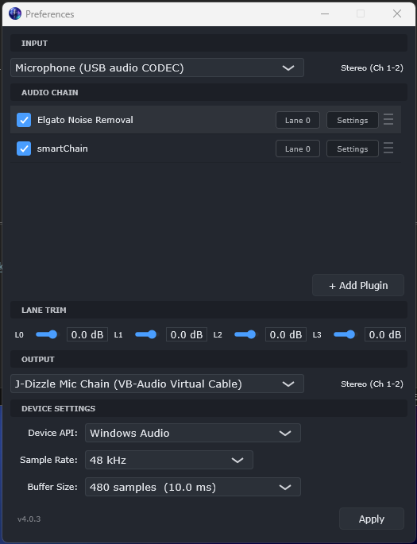
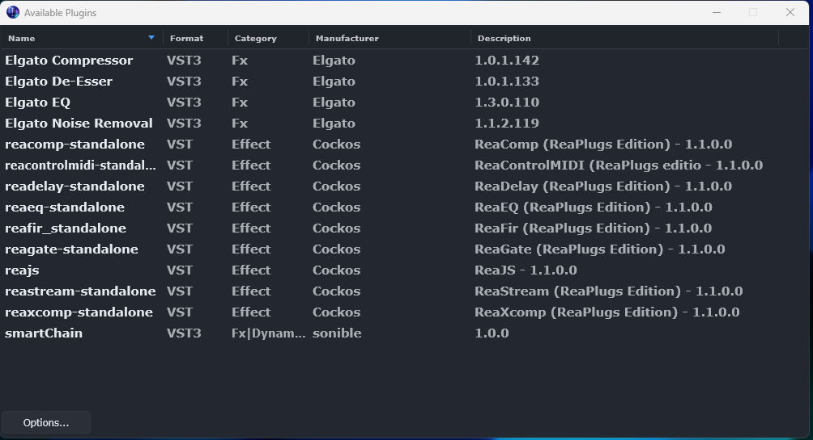
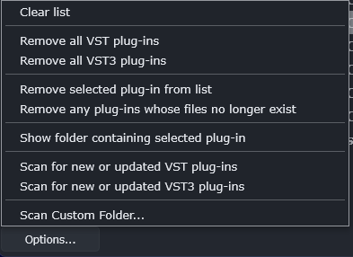

# Light Host

**Your plugins, on your microphone, all the time — without opening a DAW.**

Light Host is a tray-resident audio plugin host. It takes one audio input, runs it
through a chain of VST/VST3/AU plugins, and sends the result to one audio output.
That is the whole idea. There is no timeline, no mixer, no project file, and no
main window — just a tray icon and the settings panel below.

Point it at your microphone, add a gate, an EQ and a compressor, send the result
to a virtual cable, and every application on the machine hears your processed
voice. Set it up once and forget it is running.

<p align="center">
  
</p>

---

## Contents

- [Why you might want this](#why-you-might-want-this)
- [Quick start](#quick-start)
- [Adding plugins](#adding-plugins)
- [Processing audio from other applications](#processing-audio-from-other-applications-windows)
- [Lanes, trims and delay compensation](#lanes-trims-and-delay-compensation)
- [Testing your chain on a file](#testing-your-chain-on-a-file)
- [Where your settings live](#where-your-settings-live)
- [Running more than one instance](#running-more-than-one-instance)
- [When something goes wrong](#when-something-goes-wrong)
- [Known limitations](#known-limitations)
- [Building from source](#building-from-source)
- [Tests](#tests)
- [Licence](#licence)

---

## Why you might want this

- **A permanent processing chain for your microphone.** Every app on the machine
  gets the processed signal, not just the one you have open.
- **No DAW tax.** A DAW to run three plugins on a mic means a project file, a
  transport, and a window you have to keep alive. This is a tray icon.
- **Parallel processing without a mixer.** Up to four lanes, summed at the output,
  with automatic delay compensation so they stay sample-aligned.
- **It stays out of the way.** No timers, no animation, no polling, no update
  check, and no network access of any kind. Idle cost is nothing.

### What it is not

Not a DAW, not a recorder, and not a mixer. There is no MIDI routing, no
side-chain, no metering and no recording. If you need those, you need a DAW.

---

## Quick start

1. **Download** the archive for your platform from
   [Releases](https://github.com/bigfnj/LightHost/releases), unzip it, and run it.
   Nothing to install; the Windows build is a single self-contained `.exe`.
2. **Left-click the tray icon** to open Preferences.
3. **Pick your input and output** devices at the top and bottom of the panel.
4. **Click `+ Add Plugin`.** The first time, Light Host needs to know what you
   have installed — see [Adding plugins](#adding-plugins).
5. **Click `Apply`.** It will tell you what it did.

Your chain, plugin settings, lane assignments, bypass states, trims and device
choices are all restored next launch.

> **Quit from the tray menu**, not by killing the process. That is what writes
> your plugin settings to disk.

---

## Adding plugins

`+ Add Plugin` lists what Light Host already knows about. To scan for plugins, use
**Edit Plugins** from the tray right-click menu:

<p align="center">
  
</p>

The `Options…` button holds the scanning controls, including a **Scan Custom
Folder…** item for plugins installed somewhere non-standard:

<p align="center">
  
</p>

Light Host does not prune your scanned list. A plugin that will not load is
reported and skipped, and stays in the list so you can see it is there.

### Supported formats

| Platform | Formats |
|---|---|
| Windows | VST, VST3 |
| macOS | VST, VST3, AU |
| Linux | VST, VST3 |

---

## Processing audio from other applications (Windows)

Running plugins on your **microphone or audio interface** works out of the box:
select it as the input and you are done.

Running plugins on **audio from other applications** — a browser, a game, a media
player — needs one extra piece, and it is worth being precise about why.

Windows *can* capture another application's playback: WASAPI has supported
loopback since Vista, and Windows 10 2004 added a per-process version. **JUCE does
not expose either.** So the limitation is in the framework Light Host is built on,
not in the operating system, and a virtual audio device is the way around it
today. If that ever changes, it is tracked in [BACKLOG.md](BACKLOG.md).

The usual choice is **[VB-CABLE](https://vb-audio.com/Cable/)** (donationware;
needs admin rights and a reboot). Its naming trips up nearly everyone, because the
names are from the cable's point of view rather than yours:

| VB-CABLE calls it | It actually is | You will find it in |
|---|---|---|
| **CABLE Input** | a playback device — audio goes *into* the cable here | your **Output** list |
| **CABLE Output** | a recording device — audio comes *out* of the cable here | your **Input** list |

So to process system audio:

1. Set **CABLE Input** as the Windows playback device (or per-app in Volume Mixer).
2. In Light Host, choose **CABLE Output** as the input and your real speakers as
   the output.

Audio then flows: application → CABLE Input → Light Host → your plugins → your
speakers.

To send your *processed microphone* to other apps, run it the other way: real
microphone in, **CABLE Input** out, and point Teams, Discord or OBS at **CABLE
Output**.

> **Check the Communications role.** Windows keeps a separate default recording
> device for "Communications", and Teams, Zoom and most softphones use it. If it
> still points at your raw microphone, those apps bypass your entire chain.

Light Host does not bundle, download or install VB-CABLE. It only notices whether
a virtual input exists, and offers a **Get VB-CABLE** button that opens the
vendor's page. VoiceMeeter and other virtual audio drivers work equally well.

---

## Lanes, trims and delay compensation

Every plugin sits on a **lane** (0–3). Plugins on the same lane run in series;
lanes run in parallel and sum at the output. One lane is an ordinary serial chain,
which is what most setups want.

**Delay compensation is automatic** and done by JUCE's `AudioProcessorGraph`: it
accumulates each node's reported latency along every path, takes the maximum
across paths feeding a node, and delays the shorter ones. All lanes arrive
sample-aligned, and the host reports the slowest lane as its own latency.
Bypassed plugins keep their latency, which is correct — a plugin that reports
latency must produce the same latency when bypassed, so bypassing one does not
shift its lane in time.

**Preferences shows what it costs.** Under Device Settings, the `Latency` row
gives the chain's declared latency, the device's own input and output latency,
and the sum — the figure you actually experience. It updates when a plugin
re-declares its latency, so switching a plugin's latency mode shows the cost at
the moment you change it. Note that `Buffer Size` above it is the *device* block
size and not the answer: a 10 ms buffer sitting under a 94 ms plugin chain is a
number that misleads if it is the only one on screen.

It is a readout, not a setting. Plugin latency is inherent to the plugins, and on
a live monitoring path there is nothing for the host to compensate — the only
levers are which plugins you load and their own latency modes.

**Lane trims** exist because parallel lanes fed the same input sum coherently:
four lanes of similar material arrive about 12 dB hot, two lanes about 6 dB. Each
lane gets a fader from mute to +12 dB, unity by default. They apply as you drag —
a level control you cannot hear while moving is not much use — and are written to
disk when you let go. Double-click to return to unity. Each trim ramps over 20 ms
so a change does not click.

A trim belongs to the lane, not the plugins on it. Empty lane 2 and its trim stays
put for whatever you add next.

---

## Testing your chain on a file

Judging a microphone chain by talking into it tells you very little. You cannot
say the same sentence twice, so you cannot A/B two settings against identical
audio, and level differences alone will convince you one of them is better. So
the host can push a file through the chain you have configured and write the
result.

**In the app:** *Preferences → Chain Test*. It asks for an input file and an
output folder, renders, then reveals the file. The window stays usable while it
works.

**From the command line:**

```
"Light Host" --render input.wav output.wav
```

It reports what it did — plugins active and bypassed, connection count, declared
latency, frames written — along with every active plugin's parameter values, read
back out of the plugin *after* its saved state was restored. A measurement is
only worth as much as the settings it ran under, and reading those out of the
plugin beats reading them off a screenshot.

### It renders in real time, deliberately

A render is paced so a minute of audio takes a minute. That looks wasteful and is
not.

Plugins that run neural inference do it on a worker thread. Rendered at thirty
times real time that thread never keeps up, the plugin falls back to passing the
dry signal through, and the render prints `RENDER OK` having measured nothing.
This is not hypothetical. A DeepFilterNet-based denoiser measured **0.55 dB** of
noise reduction that way, and on a quieter take it appeared to *raise* the noise
floor by 8.5 dB. Paced to real time, the same plugin at the same settings removed
**24.8 dB** of keyboard noise for 1.7 dB of speech level. Every conclusion drawn
from the unpaced numbers was wrong, and none of them looked wrong at the time.

`--fast` skips pacing for plugins known to work synchronously and is roughly
thirty times quicker. Every render prints a `realtime factor` and says when it
could not keep pace — phrased as an observation, not a verdict, because a
synchronous plugin was measured falling behind on 998 of 10,224 blocks while
producing bit-identical output.

### Comparing plugins and settings

| Flag | What it does |
|---|---|
| `--param "NAME=VALUE"` | Sets a parameter using the plugin's own text parser |
| `--param "NAME@0.25"` | Sets the raw normalised position instead |
| `--chain "A,B"` | Renders through these plugins instead of the saved chain |
| `--fast` | Skips real-time pacing |

`--chain` looks names up in the scanned plugin list rather than the saved chain,
so a candidate can be measured against your current setup without being added to
it first — comparing two plugins should not require reconfiguring the thing you
are measuring.

```
"Light Host" --render take.wav out.wav --chain "Alt Denoiser" --param "Attenuation Limit=0"
```

A render writes nothing back: not settings, not plugin state, not node ids. It is
safe to run against a live configuration, and it opens no audio devices, so it
does not disturb a running instance.

---

## Where your settings live

| | Path |
|---|---|
| Windows | `%APPDATA%\Light Host\` |
| macOS | `~/Library/Preferences/` and `~/Library/Logs/Light Host/` |
| Linux | `~/.config/Light Host/` |

Two things live there:

- **`Light Host.settings`** — your chain, order, lanes, bypass states, trims and
  device selection. Readable XML, and small: about twelve kilobytes.
- **`Light Host.state/`** — one gzip-compressed file per plugin, holding that
  plugin's own saved settings.

Plugin state used to live base64-encoded inside the settings file. On a real chain
of five plugins that made the file 7.5 MB, of which 99.84% was plugin state — and
because `juce::PropertiesFile` rewrites the whole document on every save, toggling
one bypass wrote seven and a half megabytes. Splitting them out means a bypass
toggle writes twelve kilobytes, and only the plugin that actually changed is
written at all.

Upgrading from an earlier version migrates this once, on first launch. The file is
written, read back and verified *before* the old copy is dropped, so a failed
migration leaves your presets where they were rather than losing them.

**Worth backing up.** `Light Host.state/` holds anything you have trained or
tuned inside a plugin, and some of that is not quickly reproducible.

> The tray menu has **Delete Plugin States** one item below **Quit**, with no
> confirmation. It wipes every plugin's saved settings.

---

## Running more than one instance

```bash
Light Host -multi-instance=NAME
```

Starts a second, independent copy with its own settings file and its own state
directory — so you can run one chain on a microphone and another on system audio
without them fighting over one configuration.

The name goes into a filename, so it is reduced to letters, digits, hyphens and
underscores and capped at 32 characters. A name containing a path separator would
otherwise write outside the settings folder; one containing a character the
filesystem rejects would produce a file that could never be saved. A name that
sanitises to nothing becomes `instance` rather than silently falling back to your
main configuration.

**Without that flag, a second launch does nothing.** It hands its command line to
the copy already running and exits — which is normal single-instance behaviour,
but it used to be completely silent, so launching a newly built copy looked like
nothing had happened while you carried on inspecting the old one. It now says so,
in the log and in the status row, and brings Preferences to front.

---

## When something goes wrong

**Hover the tray icon.** When something has failed, the tooltip says what: a
plugin that would not load, a plugin that refused its saved settings, an audio
device that would not open, a settings file that could not be written. The same
message sits at the top of Preferences with a **Show Log** button beside it,
because a tooltip is only found by someone who already suspects something.

**The log** is a single rotating file, trimmed to 256 KB on every launch:

| | Path |
|---|---|
| Windows | `%APPDATA%\Light Host\LightHost.log` |
| macOS | `~/Library/Logs/Light Host/LightHost.log` |
| Linux | `~/.config/Light Host/LightHost.log` |

It records startup and shutdown, audio configuration at startup and on every
device change (driver, device names, active-versus-total channels, sample rate,
buffer size), plugin loads and failures, graph rewiring, Preferences activity,
Apply operations, and every exception caught around plugin state, plugin-list
mutation and device switching. Each run starts with a
`==== Light Host vX.Y.Z starting at <time> ====` banner.

If the host disappears without a message, the log is the first place to look.

---

## Known limitations

- **Stereo-focused routing.** Two channels in, two channels out.
- **No metering.** Lane trims are set by ear or by watching your output device.
- **No MIDI, no side-chain, no recording, no undo.**
- **Plugins run in-process.** A plugin that crashes takes the host with it. Real
  sandboxing is a different application, not a fix.
- **Nothing is code-signed.** Windows shows a SmartScreen warning on first run;
  macOS refuses the app until you right-click → Open or run
  `xattr -dr com.apple.quarantine "Light Host.app"`.
- **Renaming an audio device** after selecting it can orphan the selection,
  because JUCE stores the device by display name rather than by a stable id. It
  falls back to the default device without saying so — check the log if audio
  turns up somewhere unexpected.
- **No echo cancellation.** If your speakers are audible to your microphone,
  Light Host cannot remove them: cancelling an echo requires knowing what was
  played, and Light Host has no access to that. Use headphones, or leave your
  conferencing application's echo cancellation switched on — it *does* know.
  Assessed in detail in [DECISIONS.md](DECISIONS.md).

Known bugs, as distinct from missing features, are in [BACKLOG.md](BACKLOG.md).
Things deliberately not built, and why, are in [DECISIONS.md](DECISIONS.md).

---

## Building from source

Light Host vendors JUCE 9.0.1 and the VST2 SDK, so there is nothing to fetch
beyond a compiler and CMake.

### Windows

- Visual Studio 2026, Windows SDK `10.0.26100.0`
- CMake `4.2+` (required by the Visual Studio 18 2026 generator)

```bash
cmake --preset release
cmake --build --preset release
```

The C runtime is linked statically, so the executable needs no Visual C++
redistributable and can be copied to another machine as a single file.

### macOS

- Xcode command line tools, Ninja, CMake `3.28+`

Builds universal (`arm64;x86_64`) with a macOS 11 floor, so one binary runs on
Apple Silicon and Intel. Use `-DCMAKE_OSX_ARCHITECTURES=arm64` for a faster local
build.

### Linux / WSL

- GCC or Clang, Ninja, CMake `3.28+`, `pkg-config`

```bash
sudo apt install libasound2-dev libfontconfig1-dev libfreetype6-dev \
  libxcomposite-dev libxcursor-dev libxi-dev libxinerama-dev \
  libxkbcommon-dev libxrandr-dev libxrender-dev
cmake --preset ninja-release
cmake --build build/ninja-release -j2
```

`libxi-dev` is needed by JUCE 9 and was not by JUCE 8; without it the build fails
on `X11/extensions/XInput2.h`.

### Presets

`default` · `release` · `ninja-debug` · `ninja-release` · `ninja-relwithdebinfo` ·
`clang-debug` · `clang-release` · `mingw-release`

The built application lands in
`build/<preset>/LightHost_artefacts/<config>/Light Host[.exe]`.

---

## Tests

Unit tests build by default (`-DLIGHTHOST_BUILD_TESTS=OFF` to skip) and run under
CTest. They use `juce::UnitTestRunner`, so there is no third-party dependency. No
audio device and no real plugin are needed, so they run identically everywhere.

```bash
cmake --build --preset release
ctest --test-dir build/release -C Release --output-on-failure
```

What they cover:

- **Lane alignment**, rendered through a real `AudioProcessorGraph` with stub
  processors that declare latency — passthrough, one lane, two lanes of differing
  latency, four chained lanes whose latencies cross block boundaries, equal-latency
  lanes, and a bypassed lane. Each asserts one impulse on one sample and the
  correct reported host latency.
- **Chain wiring**, as a pure function over node facts with no graph at all:
  serial order, parallel lanes, mono-to-stereo duplication, mono destinations,
  nodes that cannot carry audio being wired around, corrupt lane indices being
  clamped, and the two invariants live rewiring depends on.
- **Lane trims**, rendered rather than reasoned about: unity is transparent, −6 dB
  halves, the range clamps, a mid-stream change ramps instead of stepping, and
  re-preparing does not fade the lane in.
- **Chain settings**: identity surviving a plugin update and a rename while still
  telling apart two plugins inside one shell file, staged writes invisible until
  commit and undone by rollback, an erase leaving no field behind, ordering ties
  broken deterministically, and the one-shot migration from the old key format.
- **Plugin state**: a good blob round-trips, an empty one reports "nothing saved"
  rather than failure, a plugin that throws out of `setStateInformation` reports
  failure without letting the exception escape, and the resulting rule — never
  save a node whose restore failed — leaves the stored preset intact.
- **The state vault**: round trips, that compression is actually running, and the
  three ways a file can be unusable (absent, truncated, written by a later
  version) all reading as "nothing stored" rather than as garbage handed to a
  plugin.
- **Instance names**: every escape attempt a `-multi-instance` name could make.
- Plus the sample-rate correction policy and the status sink.

### Startup smoke test

```bash
"Light Host" -self-test
```

Runs the real application — real device manager, real graph, real tray icon, real
message loop, real teardown — inspects its own log, prints `SELF-TEST PASS` or a
list of failures, and exits non-zero on any problem. Settings and log go to a
throwaway folder unique to the run, so it can never read or overwrite your real
configuration; the folder is deleted on success and kept on failure.

Every run starts from a seeded one-plugin chain written in the old settings
format, so it covers the one-shot migration, the move of plugin state into its own
file, a plugin that cannot be instantiated being reported and skipped rather than
stalling the load, and the rule that a plugin which never loaded keeps its saved
state. The seeded plugin matches no registered format, so none of this needs a
real plugin on disk.

CTest registers three: a first run, an identical repeat, and one with
`-multi-instance=`. They are labelled `smoke`, so `ctest -L unit` and
`ctest -L smoke` can be run separately.

This is the only automated check that exercises the destructor ordering in
`~IconMenu` that prevents a shutdown crash — and it is not a substitute for
testing that by hand. On a machine with no audio device no callback thread ever
starts, so the race the ordering guards against cannot occur. It proves the
ordering code runs cleanly, not that the race is fixed.

On Linux this needs a display: JUCE does not degrade gracefully without one, so
CMake registers the smoke tests only when `xvfb-run` is present.

---

## Project layout

```text
.
├── Source/          Application source
├── Tests/           Unit tests (juce::UnitTestRunner)
├── Resources/       Icons and binary resources
├── docs/images/     Screenshots used by this README
├── Utilities/       Helper scripts
├── lib/             Vendored JUCE 9.0.1 + VST2 SDK
├── CMakeLists.txt   Build definition (the only place the version lives)
├── CMakePresets.json
├── CHANGELOG.md     What changed, and why
├── BACKLOG.md       Known bugs and remaining work
├── DECISIONS.md     What was considered and not built, and why
└── RELEASING.md     How a release is cut
```

---

## Licence

Light Host's own source is **GPLv2-or-later**, inherited from Rolando Islas's
original Light Host.

**The application as a whole is conveyed under AGPLv3.** It links JUCE, which is
AGPLv3 unless you hold a commercial JUCE licence, and this project does not. It
also uses the Steinberg ASIO SDK under its GPLv3 option. GPLv2-or-later can be
taken up to GPLv3, and GPLv3 and AGPLv3 may be combined, so the result is
distributable — but anyone receiving a Light Host binary receives AGPLv3 terms.

One exception: the Steinberg VST 2.4 SDK headers in `lib/vstsdk2.4` are governed
by Steinberg's own agreement, which is not GPL-compatible and is not covered by
the grant above. VST2 hosting is on by default (`JUCE_PLUGINHOST_VST=1`); building
with it off and removing that directory gives a tree without the exception.

See [`license`](license) for the full picture including the VST2 exception,
[`agpl-3.0.txt`](agpl-3.0.txt), [`gpl.txt`](gpl.txt), and
[`third_party`](third_party) for every bundled component.
